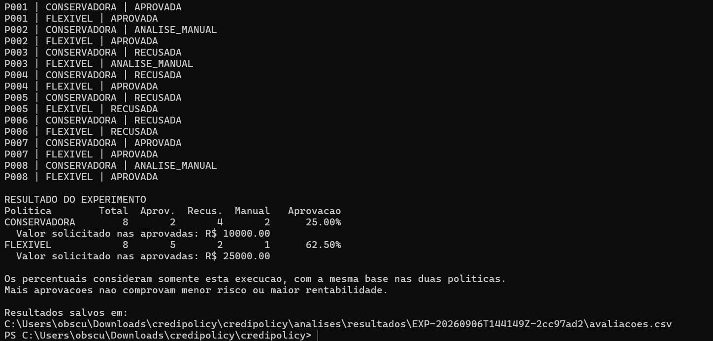

# CrediPolicy — Motor de Decisão de Crédito

Simulador educacional de políticas de crédito desenvolvido com **Java 21, Spring Boot, SQL e Python**, aplicando os padrões **Strategy, Chain of Responsibility e Facade**.

O projeto avalia propostas fictícias, explica as decisões e permite comparar o efeito de diferentes políticas sobre a mesma população.

## Problema de negócio

Como mudanças nas faixas de score e no comprometimento máximo de renda alteram as aprovações e os encaminhamentos para análise manual?

O CrediPolicy explora essa pergunta por meio de regras explícitas, decisões registradas e um experimento reproduzível.

## Funcionalidades

- Seleção entre políticas conservadora e flexível;
- Validação dos dados de entrada;
- Classificação por faixas de score;
- Cálculo de parcelas fixas com taxas ilustrativas;
- Avaliação da capacidade de pagamento;
- Decisões APROVADA, RECUSADA e ANALISE_MANUAL;
- Motivo e versão da política em cada decisão;
- Histórico persistido em banco H2;
- Indicadores calculados por SQL;
- Experimento comparativo automatizado em Python.

## Padrões de projeto

| Padrão | Aplicação |
|---|---|
| Strategy | Alternância entre políticas de crédito. |
| Chain of Responsibility | Sequência de verificações de score, capacidade de pagamento e conclusão. |
| Facade | Coordenação da validação, seleção da política, avaliação e gravação. |

O Spring gerencia os componentes e suas dependências. O Spring Data JPA fornece as operações de persistência.

A implementação está explicada em [Arquitetura e padrões](docs/03-arquitetura-e-padroes.md).

## Políticas simuladas

| Critério | Conservadora | Flexível |
|---|---|---|
| Score elegível para aprovação | 700 a 1.000 | 600 a 1.000 |
| Score para análise manual | 650 a 699 | 550 a 599 |
| Score recusado | Abaixo de 650 | Abaixo de 550 |
| Comprometimento máximo da renda | 30% | 35% |

A capacidade de pagamento considera os compromissos mensais existentes mais a parcela da nova operação.

Mesmo com score elegível, uma proposta será recusada quando ultrapassar o comprometimento permitido.

As duas políticas utilizam a mesma tabela ilustrativa de taxas: 2% ao mês para score a partir de 800, 3% para score entre 700 e 799 e 4% para scores inferiores a 700.

Os parâmetros são escolhas educacionais, sem calibração com dados reais. As taxas não representam ofertas comerciais nem CET.

Consulte as [regras completas](docs/01-politicas-de-credito.md).

## Resultado do experimento

Foram avaliadas oito propostas sintéticas nas duas políticas, totalizando 16 avaliações.

| Indicador | Conservadora | Flexível |
|---|---:|---:|
| Propostas avaliadas | 8 | 8 |
| Aprovadas | 2 | 5 |
| Recusadas | 4 | 2 |
| Análise manual | 2 | 1 |
| Aprovação | 25% | 62,5% |
| Valor solicitado nas aprovadas | R$ 10.000,00 | R$ 25.000,00 |

A diferença foi de **37,5 pontos percentuais de aprovação**, com três aprovações adicionais na política flexível.

Maior aprovação não comprova menor risco ou maior rentabilidade. Os valores representam solicitações aprovadas na simulação, não crédito contratado ou desembolsado.

A base foi construída para testar regras e não representa uma amostra de clientes reais.

Veja a [análise dos resultados](docs/02-resultados-experimento.md).



## Tecnologias

- Java 21;
- Spring Boot 4.1.1;
- Maven Wrapper;
- Spring Web e Validation;
- Spring Data JPA;
- H2 Database;
- JdbcTemplate e SQL;
- JUnit;
- Python 3.13, utilizando apenas a biblioteca padrão.

## Organização

```text
credipolicy-motor-de-credito/
├── README.md
├── pom.xml
├── mvnw
├── mvnw.cmd
├── .mvn/
│   └── wrapper/
├── src/
│   ├── main/
│   │   ├── java/br/com/credipolicy/
│   │   └── resources/
│   └── test/
│       ├── java/br/com/credipolicy/
│       └── resources/
├── data/
│   └── propostas_sinteticas.csv
├── analises/
│   ├── executar_experimento.py
│   └── resultados/
├── docs/
│   ├── 01-politicas-de-credito.md
│   ├── 02-resultados-experimento.md
│   └── 03-arquitetura-e-padroes.md
├── evidencias/
│   └── 01-comparacao-politicas.png
└── dados-locais/
    └── .gitignore
```

Os arquivos do banco local e a pasta de compilação `target` não devem ser publicados.

## Como executar no Windows

### Pré-requisitos

- JDK 21 instalado;
- Python 3.13 para executar o experimento;
- Acesso à internet na primeira execução para baixar as dependências.

Baixe ou clone o repositório e abra o PowerShell na pasta que contém `pom.xml` e `mvnw.cmd`.

### Executar os testes

```powershell
.\mvnw.cmd test
```

Na versão documentada, foram executados **64 testes, sem falhas ou erros**.

Os testes usam bancos H2 em memória, separados do banco local da aplicação.

### Iniciar a API

```powershell
.\mvnw.cmd spring-boot:run "-Dspring-boot.run.arguments=--server.address=127.0.0.1"
```

Mantenha esse terminal aberto. Para encerrar a aplicação, pressione `Ctrl+C`.

Confira o funcionamento em:

[http://127.0.0.1:8080/api/status](http://127.0.0.1:8080/api/status)

## Avaliar uma proposta

Em outra janela do PowerShell:

```powershell
$proposta = @{
    identificador = "EXEMPLO-001"
    score = 680
    rendaMensal = 5000
    compromissosMensais = 1000
    valorSolicitado = 5000
    prazoMeses = 24
    politica = "CONSERVADORA"
} | ConvertTo-Json

Invoke-RestMethod `
    -Uri "http://127.0.0.1:8080/api/avaliacoes" `
    -Method Post `
    -ContentType "application/json" `
    -Body $proposta |
    ConvertTo-Json -Depth 5
```

Resultado esperado: `ANALISE_MANUAL`, com parcela de R$ 327,93.

Ao avaliar os mesmos dados com `FLEXIVEL`, o resultado esperado é `APROVADA`. A taxa e a parcela permanecem iguais.

Cada envio válido gera um novo registro, inclusive quando a decisão é recusa ou análise manual.

Entradas inválidas retornam HTTP 400 e não geram uma avaliação gravada. Valores monetários aceitam até 12 dígitos inteiros e duas casas decimais.

## Consultas disponíveis

| Método | Endereço | Resultado |
|---|---|---|
| GET | `/api/status` | Estado da aplicação. |
| POST | `/api/avaliacoes` | Avaliação e gravação de uma proposta. |
| GET | `/api/avaliacoes` | As 50 avaliações mais recentes. |
| GET | `/api/indicadores` | Indicadores de todas as avaliações, agrupados por política e versão. |

Os indicadores incluem testes manuais e execuções repetidas. Não representam contagem de clientes únicos.

## Executar o experimento Python

Com a API funcionando, abra outro PowerShell na raiz do projeto:

```powershell
py -3.13 analises\executar_experimento.py
```

O script:

1. Lê as oito propostas do CSV;
2. Envia cada proposta às duas políticas;
3. Registra 16 avaliações pela API;
4. Salva um CSV em uma pasta exclusiva da execução;
5. Apresenta os resultados de cada política no terminal.

Não é necessário instalar pacotes Python adicionais.

Cada execução acrescenta novos registros ao banco. O resumo do script considera apenas aquela execução, sem misturar avaliações anteriores.

## Persistência

O H2 grava os dados em `dados-locais`, usando um caminho relativo à pasta de execução.

Inicie a aplicação sempre pela raiz do projeto para utilizar o mesmo banco.

Foi verificado que uma avaliação permanece disponível após reiniciar a aplicação, mantendo o mesmo UUID e horário de criação.

A configuração utiliza atualização automática de tabelas para o protótipo local. Uma evolução para produção exigiria migrações de banco versionadas.

## Limitações

- Uso exclusivamente educacional, com propostas fictícias;
- Sem integração com bancos ou bureaus;
- Score fornecido como entrada, sem treinamento de modelo preditivo;
- Taxas ilustrativas, sem precificação calibrada por risco;
- Sem cálculo de CET ou de valor máximo financiável nesta versão;
- Sem dados de inadimplência, perdas ou rentabilidade;
- Sem autenticação; execução configurada para acesso local;
- Histórico da API limitado às 50 avaliações mais recentes;
- Alterações futuras nas regras exigem atualização explícita da versão da política.

Não utilize dados pessoais, bancários ou de clientes reais.

## Evoluções possíveis

- Cálculo do valor máximo financiável;
- Filtros por experimento e paginação do histórico;
- Análise com bases maiores e dados de desempenho;
- Desenvolvimento e validação de um modelo de score;
- Evolução do processamento de carteira com Spark e Databricks.

## Contexto acadêmico

Projeto desenvolvido para o desafio **Design Patterns com Java: Dos Clássicos (GoF) ao Spring Framework**, da DIO, com adaptação para políticas e decisão de crédito.

## Autor

Antony Kennedy Ribeiro de Araújo.